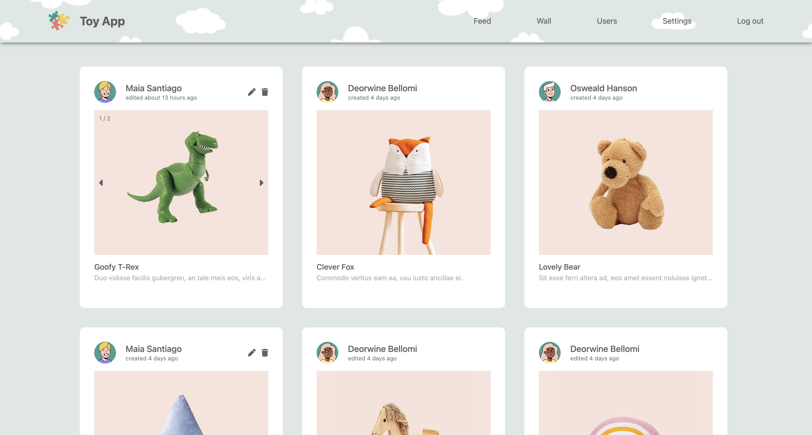
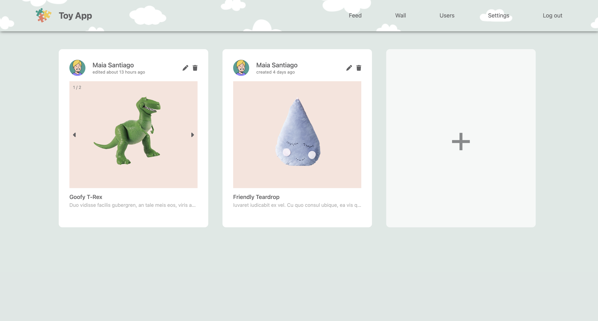
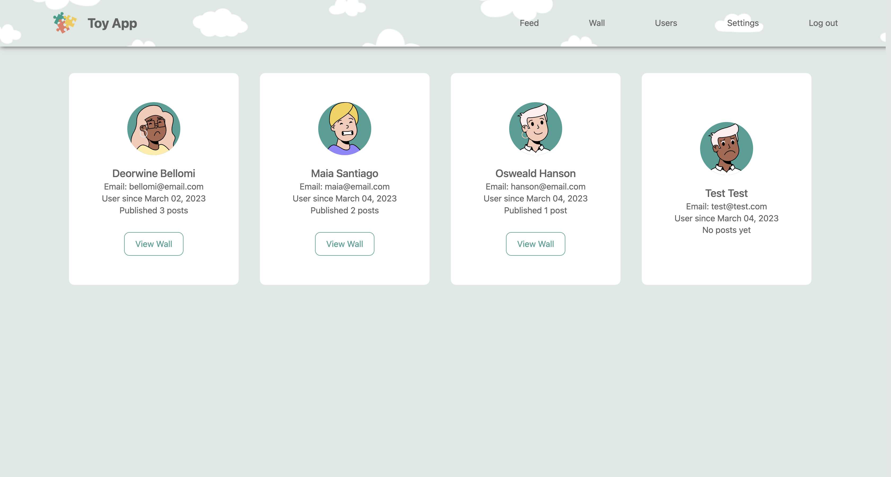
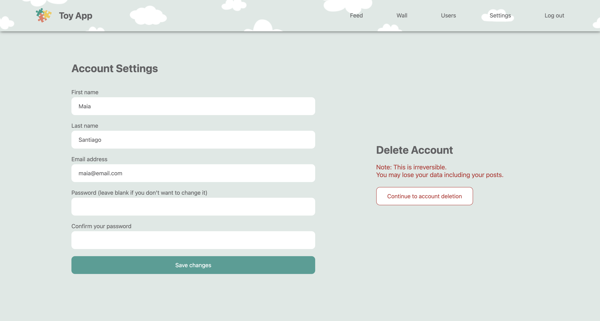

### ✨ [Toy App (Click to see live version)](https://toy-app-pqe2.onrender.com/)

>> ###### *A Ruby on Rails application allowing users to post their toys.*
>> - Manually created a set of model, views, and controller for user and post table and create a full CRUD web interface.
>> - Installed Bcrypt Ruby gem so users can log in and sign up using email and password.
>> - Implemented model and system tests to simulate user interaction.
>> - Allowed user to preview images for upload and implemented image carousel using stimulus.
>> - Added new and edit post modal using turbo frames.
>> - Implemented active storage for the local environment and S3 buckets for deployment.
>> - Displayed user avatars by utilizing DiceBear avatar library.
>> - Showed flash messages using turbo.

>> ##### **Sign in as admin**
>> - Email address: admin@email.com
>> - Password: admin123

>> ###### Sources:
>> - Images from [canva](canva.com), [linkpicture](linkpicture.com), and [playroom](https://playroom.qodeinteractive.com)
>> - [Rails](https://drive.google.com/file/d/1lx8bkaXAfSo9rv20O_ZOpeFmEZkgmjyc/view), [Stimulus](stimulus.hotwired.dev), and [Turbo Drive](https://www.hotrails.dev/turbo-rails/turbo-drive) handbook.
>> - [DiceBear Avatar Library](https://avatars.dicebear.com/)
